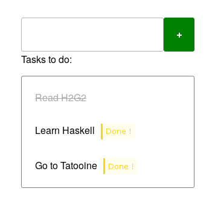

# Introduction to Elm

This tutorials aims to practice Elm! In the first part, you
will add a small functionnality to the counter example.Then, you will
create a Todo-list application.

You will probably need to look at [the slides of the lecture](https://slides.com/sebbes/the-web-teaching-server-elm-intro/)
(`Ctrl+Click` to open in a new tab).

## The counter

1. Open [Ellie the online editor](https://ellie-app.com) (`Ctrl+click`
   to open in a new tab). The counter
   programm is already loaded.
2. Add a "Reset" button that resets the counter to 0. You may need to
   add new message ;) .


## Todo list

1. Open [the Todo-list skeleton](https://ellie-app.com/5Zg6cdDp3BJa1)
   (`Ctrl+click` to open in a new tab).
1. Replace the `view` function in order to display  a list of
    three tasks  to do (e.g. "Learn Haskell", "Read H2G2",
    "Go to Tatooine") using `ul` and `li`. You can ignore the
    `model` argument for the moment.
1. Add the text "3 tasks to do:" at the top of the list. You may need
   to enclose the list in a `div`.
1. Redefine the `Model` type with:
    ```elm
    type alias Model =
        { tasks : List String }
    ```
    and redefine the `initialModel : Model` variable which contains
    the three tasks you have listed above.
1. Create a function `viewTask : String -> Html msg` that
   displays a thing to do. It should return a `li`.
1. Use `List.map` and the `model` argument to display the
   tasks to do.
1. Compute the number of elements in the list `tasks` with `List.length : List a -> Int`
   to display "3 tasks to do:" without hardcode the "3".
1. Inspect the HTML code produced by Elm ("right click > inspect element"
    or "F12") to see if it matches what you think.

## Add status to the tasks

We would like to be able to say whether a Task is complete. For that
purpose, we will need to define new types to store this information.

1. Create the following type:
    ```elm
    type alias Task =
        { label: String }
    ```
    and modify the model to be:
    ```elm
    type alias Model =
        { tasks : List Task }
    ```
    Perform all the modifications needed to make your code compile! You may
    need to change `viewTask : String -> Html Msg` to
    `viewTask : Task -> Html Msg`.
1. A task can be "active" or "done". Create a custom type
   `TaskStatus` with two variants
   to represent that. Then transform the `Task` to:
   ```elm
   type alias Task =
        { label : String, status : TaskStatus }
    ```
    Perform all the modifications needed to make your code compile (mark
    all your tasks as "active" in the `init`)!
1. Transform the `viewTask` function to take this information into account
    by using a pattern matching on the `status` field (i.e.
    `case ... of ...`):
    strike the completed tasks. You may need to add
    `import Html.Attributes exposing (style)` at the top of
    your file and add `style "text-decoration" "line-through"` as attribute.
1. Transform the `Msg` to be:
    ```elm
    type Msg
        = ClikedOnDoneButton Int
    ```
    `ClikedOnDoneButton 2` will represent the fact the user has clicked on
    the "Done button" of index `2` in the list of tasks.
1. Change `viewTask: Task -> Html Msg` to
    `viewTask : Int -> Task -> Html Msg` in order to add a button
    "Done". The first argument of `viewTask` will be the index of the
    task in the list of tasks.

    You may need to use
    [`List.indexedMap : (Int -> a -> b) -> List a -> List b`](https://package.elm-lang.org/packages/elm/core/latest/List#indexedMap)
    instead of `List.map`
    in the `view` function.
1. In the `update` function, perform a pattern match on the `msg`
    to catch the `Done idx` message. You can define
    a function in a `let ... in ...` block. The code should look like this:
    ```elm
    update msg model =
        case msg of
            ClikedOnDoneButton idx ->
                let
                    transformTask : Int -> Task -> Task
                    transformTask i task =
                        -- to be completed !
                in
                { model |
                    tasks = List.indexedMap transformTask model.tasks
                }
    ```
    The function `transformTask` is only locally defined, you can not
    call it outside of the block under `Done idx`.

    Test your code by clicking on the "done" button!
1. Click on the "Debug" button at the top right in Ellie. You should see
    all the messages you have emitted by clicking on the buttons, when you click on those messages, you can see the model's state at this time!

## Add tasks in the Todo list!
We will give the ability for the user to add somme task.

Here is the outline to follow to allow the user to enter text:
1. Create a `String` field e.g. `textEntered` in the model that will
   store what the user is currently entering (what we see in the input
   field).
1. Create a message `TextEntered String` that will be sent each time the user
   is hit a letter in the input field. The parameter is the current content
   of the input field.
1. Catch the previous message in the `update` function and update the
   `enteredText` field of `model`.
1. Add a form in the `view` containing an input field and a submit button. It
    could look like:
    ```elm
    form []
        [ input [onInput TextEntered, value model.textEntered] []
        , input [type_ "submit", value "Add"] []
        ]
    ```
    (you may need to add some imports).
1. At that point, check that all is working correctly with the debugger: the
    `enteredText` field should be updated each time you enter something in
    the input field!
1. Create a `TaskSubmitted` and trigger it by adding a `onSubmit TaskSubmitted`
   in the attributes of the `form`. Deal with this new message in the `update`
   function:
   * add a task in the list of tasks. The syntax to add an element `x` to a
     list `xs` is `x::xs`. Use the `enteredText` field in the model to get
     the label of the new task.
   * reset the `enteredText` to `""` (the empty string).


## Give it some style!
The todo list is now functionnal, but not very nice!

On the bottom left panel of Ellie, you have the HTML file used to render your
application. Between the `<style>` tags, you can write somme CSS rules.
Those rules apply to the HTML generated by Elm.

In the Elm code, you can add the class `my-class` to a node by adding the attribute
`class "my-class` to the node, like:
```elm
li [class "my-class"] [text "Hello world!"]
```
Similarly, you can define "id" with the `id` function. Those functions are
in the module `Html.Attributes`, you can import them with
`import Html.Attributes exposing (id, class)`.

Here is a rudimentary example:




## Optional improvements

1. Add two buttons "Active" and "Done" to filter what tasks are
    displayed.
    * Add a `filterBy: TaskStatus` field in the model
      to store what filter the user have choosen.
    * Read about the documentation of the
      [`List.filter : (a -> Bool) -> List a -> List a`](https://package.elm-lang.org/packages/elm/core/latest/List#filter)
      function.
    * The filter function need a "predicate" as a first argument, that means
      a function returning a boolean. In most cases, the predicate is very short
      and we don't want to define a function for such short functions. You can
      then use an anonymous function with the syntax `\argument -> expression`:
      ```elm
      isPositive x = x > 0

      posNumbers =
        List.filter isPositive [ 1, 4, -5, 3, -9]
        -- gives [1, 4, 3]
      ```
      is the same as:
      ```elm
      posNumbers =
        List.filter (\x -> x > 0) [ 1, 4, -5, 3, -9]
      ```
    * Add the button "All" to display all the tasks. You may need to change
      the type of `filterBy`.
1. Add a "Urgent" status and corresponding controls to act on it.
1. Use [these slides](https://slides.com/sebbes/pratical-intro-to-algebraic-data-types/live?context=editing#/18)
   to make your application support multiple languages.


# Solution

You can see a solution here: https://ellie-app.com/67X6XLv9Lr9a1


